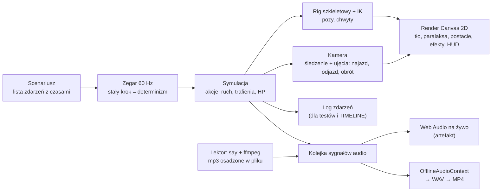
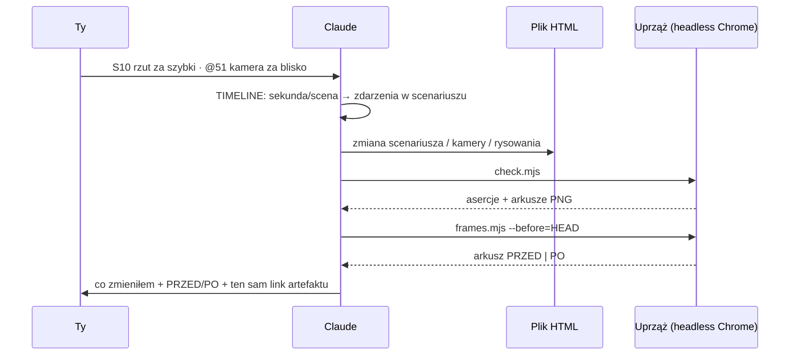
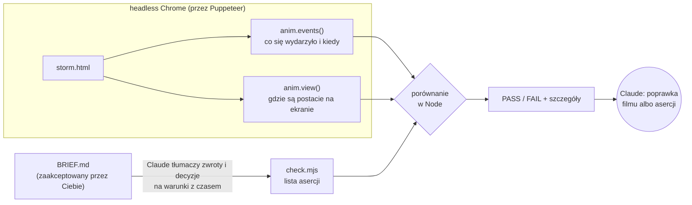

# Jak to działa: proces animacji (high level)

> Do zrozumienia i edukacji, nie jako dokumentacja na zawsze. Stan: PoC #3 (The Storm Chose Black).

## 1. Proces od pomysłu do filmu

## 2. Co to jest „silnik”
Silnik to część pliku HTML, która **zamienia scenariusz w obraz i dźwięk**. Nie jest osobnym programem. Każdy PoC ma własną kopię silnika, a skill ma go kiedyś ujednolicić.

## 3. Pętla poprawek

## 4. Toolset: czego używam i po co
| Narzędzie | Rola | Kiedy |
|---|---|---|
| **Claude Code `Write` / `Edit`** | piszę kod animacji, uprzęże, dokumenty | budowa, poprawki |
| **`Bash`** | uruchamiam node, ffmpeg, say, python, git | wszędzie |
| **`Read`** | czytam pliki i **obrazy PNG**, czyli mój „wzrok” | ocena arkuszy klatek |
| **`Artifact`** | publikuję film jako stronę na claude.ai | po każdej wersji/poprawce |
| **Przeglądarka: Canvas 2D** | rysowanie klatek | w artefakcie i w testach |
| **Przeglądarka: Web Audio / OfflineAudioContext** | synteza muzyki i SFX, render ścieżki do MP4 | dźwięk |
| **Node.js + `puppeteer-core`** | steruje przeglądarką bez okna | uprząż, TIMELINE, PRZED/PO |
| **Chrome headless shell** | przeglądarka bez okna (z cache Puppeteera) | jw. |
| **ffmpeg / ffprobe** | klatki → MP4, miks audio, obróbka głosu, pomiar głośności | eksport, lektor |
| **macOS `say`** | synteza mowy (lektor) | nagranie kwestii |
| **python3** | chirurgiczne podmiany w kodzie, osadzanie mp3 jako base64 | poprawki |
| **git / gh** | wersje, PRZED (`--before=HEAD`), GitHub | commit, push |
| **Google Fonts** | fonty strony (pędzel, piksel) | ładowane przez przeglądarkę |
| `WebSearch` / `WebFetch` | research (np. ceny TTS) | **nie** do samej animacji |

## 5. Słowa, które padają najczęściej
- **Uprząż (test harness):** skrypt (`check.mjs`), który otwiera film w przeglądarce bez okna, przewija go, zbiera log i stan, sprawdza asercje, robi arkusze klatek i MP4. To „stanowisko testowe” filmu.
- **Liczbowe kontrole:** sprawdzenia na liczbach zamiast na obrazie, np. „K.O. między 24 a 24,5 s”, „obie postacie w kadrze w 40,3 s”, „trafienie z odległości ≤ 90 px”. Są szybkie i mogą objąć każdą klatkę, a model nie musi niczego oglądać.
- **Arkusz klatek:** jeden PNG z siatką kadrów z wybranych chwil. Pokazuje próbki, nie całość, więc łapie problemy wizualne tylko w tych chwilach.

Więcej pojęć: [`pocs/GLOSSARY.md`](../pocs/GLOSSARY.md).

## 6. Asercje: kto je wymyśla i jak są sprawdzane
**Autorem asercji jestem ja (Claude), ale źródłem jest zaakceptowany BRIEF.** Każdy zwrot akcji i decyzja z briefu zamienia się w sprawdzenie z oknem czasu, np. „ZWROT 3: rzut” → „chwyt 39,2–39,5 s, uderzenie 40,5–41 s, obrażenia ≥ 40, obie postacie w kadrze”. Puppeteer **nie wymyśla** niczego: tylko otwiera film i odpytuje go o fakty. Porównanie robi zwykły kod w `check.mjs`.

**Ryzyko:** „sam sobie piszę klucz odpowiedzi”. Jak je ograniczamy:
- asercje dają się wyprowadzić z tekstu briefu (każda ma swój zwrot albo decyzję);
- jeśli zmieniam asercję, mówię o tym wprost, np. zbliżenie w PoC #3 sprawdza punkty kluczowe zamiast całych ciał;
- docelowo **asercje będą w tabeli scen w BRIEF**, więc akceptujesz je razem ze scenariuszem.

Rodzaje dziś:

| Rodzaj | Przykład | Źródło danych |
|---|---|---|
| fabuła | „K.O. BISHUKIJA 24–24,5 s”, „12 trafień monsunu” | `events()` |
| widzialność | „obie postacie w kadrze w 40,95 s” | `view()` (pozycje kości → ekran) |
| dynamika | „≥ 36 starć w trzech wymianach” | `events()` |
| technika | „0 błędów konsoli” | konsola przeglądarki |

## 7. Elementy silnika (co robi każdy klocek)
| Element | Co robi | Analogia | W kodzie (PoC #3) |
|---|---|---|---|
| **Scenariusz** | lista zdarzeń „w chwili t kto robi co i z jakim wynikiem” | scenopis reżysera | `at()`, `sys()`, `SCENES` |
| **Zegar 60 Hz** | przesuwa czas o stałe 1/60 s. Dzięki temu każde odtworzenie jest identyczne, a `seek(41.2)` daje zawsze tę samą klatkę | metronom | `tick()`, `STEP` |
| **Symulacja** | wykonuje akcje: ruch, skoki, chwyty, trafienia, HP, krew. Pyta scenariusz, *co* ma się stać, i liczy, *jak* to wygląda w czasie | aktorzy na planie | `updateActor()`, `resolveHit()` |
| **Rig + IK** | zamienia pozę („cios prosty”) na pozycje kości. IK przykleja dłoń do szyi lub pasa przeciwnika | kościec lalki | `PO`, `fkLocal()`, `ik2()` |
| **Kamera** | śledzi walczących, a w ujęciach robi najazd, odjazd albo obrót | operator | `updateCamera()`, `SHOTS` |
| **Render** | rysuje klatkę: tło i paralaksa, postacie w stylu (a) lub (b), efekty, HUD, napisy, znacznik sekundy | malarz | `render()`, `drawWorld()`, `drawFighter()` |
| **Kolejka audio** | symulacja zgłasza „tu cios”, „tu lektor”. Na żywo gra od razu, do MP4 renderuje się offline | dźwiękowiec | `cue()`, `playCue()`, `renderAudio()` |
| **Log zdarzeń** | zapisuje, co się faktycznie wydarzyło (dla asercji i TIMELINE) | kronikarz | `log()`, `EV` |
| **`window.anim`** | „okienko” dla narzędzi: przewiń, podaj stan, zdarzenia, sceny | panel serwisowy | na dole pliku |

## 8. TIMELINE: dla kogo?
**Dla obu stron.** Wejście jest to samo („@41 …”), ale TIMELINE:
- **Tobie** daje adres sceny (0:41 to S10, więc możesz powiedzieć „cała S10 wolniej”) i pamięć: po tygodniu przypomnisz sobie, co gdzie jest, bez oglądania;
- **mnie** daje dokładne miejsce w kodzie (ID zdarzeń);
- **obu** pokazuje po poprawce, co się faktycznie zmieniło.

## 9. Notatki w bazie artefaktu (koncepcja reżyserki, do weryfikacji)
- **Gdzie:** w magazynie danych przypiętym do **adresu artefaktu** na claude.ai (zbiory dokumentów). Strona zapisuje notatki przez API przeglądarki, a ja czytam i zapisuję je narzędziem `Artifact` (`read_db` / `write_db`).
- **Wersje filmu:** ponowna publikacja pod **tym samym linkiem** nie kasuje danych, bo baza jest niezależna od wersji strony. Nowy link oznacza nową, pustą bazę.
- **Notatka:** `{ id, wersja/commit, t, scena, poziom, tag, opis, status, PRZED/PO }`. Scena + czas pozwalają ją odnaleźć nawet po przesunięciach w filmie.
- **Kto zarządza statusem:** ja ustawiam `w pracy → zrobione` (z commitem i PRZED/PO), ty zatwierdzasz albo otwierasz ponownie.
- Szczegóły (limity, uprawnienia, dostępność na koncie) **do sprawdzenia** przed budową. Patrz [`ideas-director.md`](ideas-director.md).
