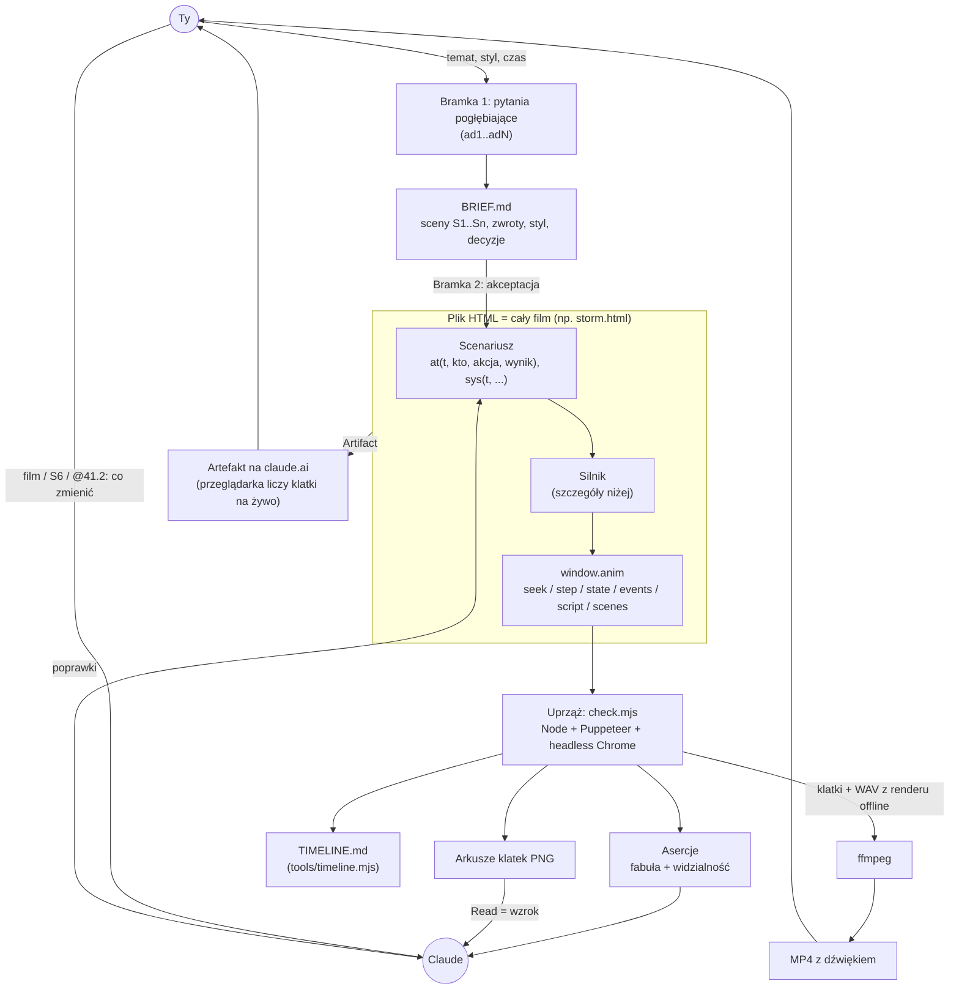
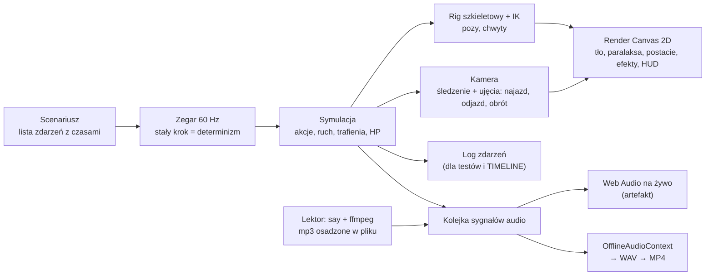
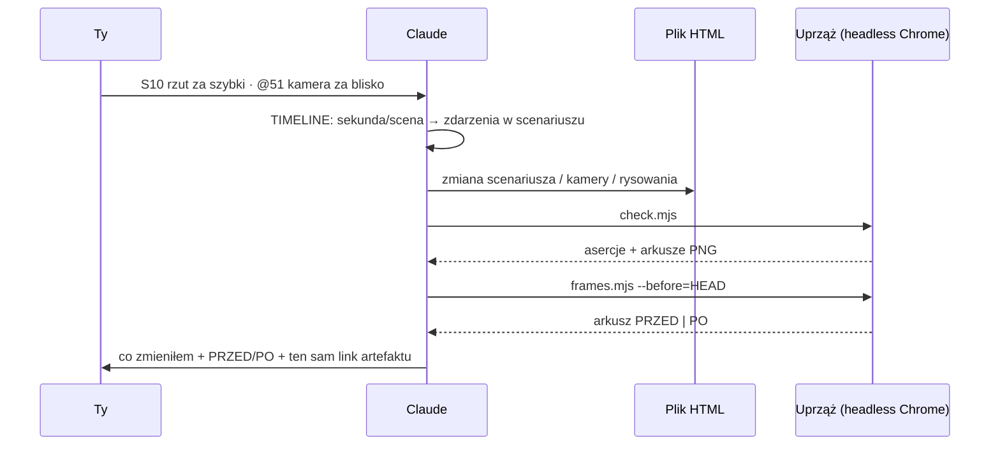

# Jak to działa: proces animacji (high level)

> Do zrozumienia i edukacji, nie jako dokumentacja na zawsze. Stan: PoC #3 (The Storm Chose Black).

## 1. Proces od pomysłu do filmu

## 2. Co to jest „silnik”
Silnik to część pliku HTML, która **zamienia scenariusz w obraz i dźwięk**. Nie jest osobnym programem. Każdy PoC ma własną kopię silnika, a skill ma go kiedyś ujednolicić.

## 3. Pętla poprawek

## 4. Toolset: czego używam i po co
| Narzędzie | Rola | Kiedy |
|---|---|---|
| **Claude Code `Write` / `Edit`** | piszę kod animacji, uprzęże, dokumenty | budowa, poprawki |
| **`Bash`** | uruchamiam node, ffmpeg, say, python, git | wszędzie |
| **`Read`** | czytam pliki i **obrazy PNG**, czyli mój „wzrok” | ocena arkuszy klatek |
| **`Artifact`** | publikuję film jako stronę na claude.ai | po każdej wersji/poprawce |
| **Przeglądarka: Canvas 2D** | rysowanie klatek | w artefakcie i w testach |
| **Przeglądarka: Web Audio / OfflineAudioContext** | synteza muzyki i SFX, render ścieżki do MP4 | dźwięk |
| **Node.js + `puppeteer-core`** | steruje przeglądarką bez okna | uprząż, TIMELINE, PRZED/PO |
| **Chrome headless shell** | przeglądarka bez okna (z cache Puppeteera) | jw. |
| **ffmpeg / ffprobe** | klatki → MP4, miks audio, obróbka głosu, pomiar głośności | eksport, lektor |
| **macOS `say`** | synteza mowy (lektor) | nagranie kwestii |
| **python3** | chirurgiczne podmiany w kodzie, osadzanie mp3 jako base64 | poprawki |
| **git / gh** | wersje, PRZED (`--before=HEAD`), GitHub | commit, push |
| **Google Fonts** | fonty strony (pędzel, piksel) | ładowane przez przeglądarkę |
| `WebSearch` / `WebFetch` | research (np. ceny TTS) | **nie** do samej animacji |

## 5. Słowa, które padają najczęściej
- **Uprząż (test harness):** skrypt (`check.mjs`), który otwiera film w przeglądarce bez okna, przewija go, zbiera log i stan, sprawdza asercje, robi arkusze klatek i MP4. To „stanowisko testowe” filmu.
- **Liczbowe kontrole:** sprawdzenia na liczbach zamiast na obrazie, np. „K.O. między 24 a 24,5 s”, „obie postacie w kadrze w 40,3 s”, „trafienie z odległości ≤ 90 px”. Są szybkie i mogą objąć każdą klatkę, a model nie musi niczego oglądać.
- **Arkusz klatek:** jeden PNG z siatką kadrów z wybranych chwil. Pokazuje próbki, nie całość, więc łapie problemy wizualne tylko w tych chwilach.

Więcej pojęć: [`pocs/GLOSSARY.md`](../pocs/GLOSSARY.md).
