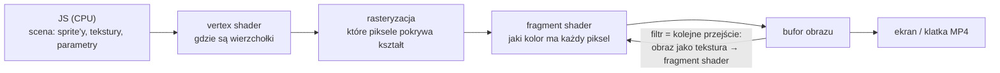

# WebGL: jak działa, czego użyliśmy, co jeszcze można

> 2026-10-09, na podstawie spike'a [`pocs/ninja-webgl/v1-spike-s6-s8`](../pocs/ninja-webgl/v1-spike-s6-s8/POSTMORTEM.md). Biblioteki: **PixiJS 8.19.0** (cdnjs) + **pixi-filters 6.1.4** (jsdelivr). Listy filtrów odczytane z załadowanych bibliotek. Podgląd na żywo wszystkich filtrów: [pixijs.io/filters/examples](https://pixijs.io/filters/examples/).

## 1. Jak działa WebGL (w skrócie)
Canvas 2D rysuje **procesorem** (CPU), kształt po kształcie. WebGL wysyła dane do **karty graficznej** (GPU), która liczy tysiące pikseli naraz małymi programami, czyli **shaderami** (język GLSL).

- **Tekstura:** obraz w pamięci GPU (u nas: warstwy narysowane Canvasem 2D).
- **Filtr (post-process):** scena renderuje się do tekstury, a potem shader przelicza każdy piksel (rozmycie, bloom, papier). Każdy filtr to co najmniej jedno przejście po wszystkich pikselach, więc **koszt ≈ liczba pikseli × liczba przejść**.
- **Uniform:** parametr shadera ustawiany z JS co klatkę (np. siła błysku, ziarno).
- **Determinizm:** GPU liczy ten sam wynik dla tych samych danych. Szum i ziarno robimy funkcją numeru klatki, więc `seek(41.2)` daje zawsze tę samą klatkę.
- **Bez GPU** (headless Chrome w uprzęży) WebGL działa programowo (SwiftShader): ok. 0,8–1,3 s na klatkę 720p zamiast ułamka milisekundy.

## 2. Czego de facto użyliśmy w spike'u
| Efekt | Jak | Źródło |
|---|---|---|
| Warstwy | Canvas 2D rysuje w 1280×720 do 4 płócien (tło, świat, przód, HUD), Pixi skleja je jako tekstury | własne (`drawBack/Mid/Front`) |
| Papier, ziarno, winieta | shader na całej klatce: włókna i plamy z szumu fbm, ziarno per klatka, przyciemnienie brzegów | **własny shader** (`PAPER_FRAG`) |
| Mokry pędzel | shader na postaciach: krawędź przesunięta szumem (postrzępienie), ciemniejsza krawędź, halo rozlania (nocą jasne) | **własny shader** (`BRUSH_FRAG`) |
| Głębia ostrości | rozmycie tła rosnące z zoomem kamery | `BlurFilter` (PixiJS) |
| Rozmycie ruchu | „duchy” wcześniejszych póz szybkich kończyn z historii symulacji | własne (Canvas 2D), nie filtr |
| Bloom nocą | świecenie jasnych miejsc (księżyc, piorun, iskry), tylko świat, HUD ostry | `AdvancedBloomFilter` |
| Światło pioruna | jasny obrys postaci, siła = błysk | `GlowFilter` |
| Piasek na GPU | 2500 sprite'ów w dwóch planach (dalszy rozmyty), pozycje z czasu | sprite'y PixiJS |
| Krew-tusz | plamy na ziemi rozlewają się przez 0,5 s | własne (Canvas 2D) |

## 3. Katalog efektów do wzięcia od ręki
★ = rekomendacja dla ninja.

### Światło
| Filtr | Co robi | U nas |
|---|---|---|
| **AdvancedBloomFilter** ★ | świecenie jasnych miejsc z progiem | już jest (noc) |
| BloomFilter | prostszy bloom | — |
| **GlowFilter** ★ | poświata wokół kształtu (wewnątrz/na zewnątrz) | już jest (piorun); aura energii przy ciosie specjalnym |
| **GodrayFilter** ★ | promienie światła (smugi przez pył) | księżyc przez burzę piaskową, słońce w intro |
| **SimpleLightmapFilter** ★ | mapa światła mnożona przez scenę | latarnia/ognisko/błysk punktowy w nocy |
| DropShadowFilter | cień pod kształtem | cienie postaci na wydmach |
| BevelFilter | wypukłość krawędzi | **metal robota BISHUKIJA** (z Adjustment/ColorMap) |

### Ruch i kamera
| Filtr | Co robi | U nas |
|---|---|---|
| **ShockwaveFilter** ★ | fala uderzeniowa (pierścień zniekształcenia) | trafienia krytyczne, lądowanie, wybuch energii (nowe fatality) |
| **ZoomBlurFilter** ★ | rozmycie promieniste od punktu | najazd kamery, „uderzenie” przy specjalu |
| MotionBlurFilter | kierunkowe rozmycie całości | szybkie przejazdy kamery |
| RadialBlurFilter | rozmycie obrotowe | obroty kamery (S4, S10) |
| TiltShiftFilter / TiltShiftAxisFilter | ostry pas, rozmyte góra/dół | efekt „makiety”, ujęcia szerokie |
| TwistFilter, BulgePinchFilter | wir, wybrzuszenie | teleport (S11), wciąganie przy dezintegracji |

### Kolor i grading
| Filtr | Co robi | U nas |
|---|---|---|
| **ColorMapFilter** ★ | LUT: pełny „look” filmowy z jednej tekstury | jeden spójny grading dnia i nocy |
| AdjustmentFilter, HslAdjustmentFilter, ColorMatrixFilter | jasność, kontrast, nasycenie, odcień | korekta dnia (papier szarzał) |
| ColorGradientFilter, ColorOverlayFilter | gradient / nakładka koloru | niebo, poświata zachodu |
| ColorReplaceFilter, MultiColorReplaceFilter | podmiana kolorów | warianty postaci (wymiana stylu, B3) |
| GrayscaleFilter | odcienie szarości | flashback, pauza |

### Stylizacja
| Filtr | Co robi | U nas |
|---|---|---|
| **OldFilmFilter** ★ | rysy, kurz, migotanie, sepia | intro/outro jak stara taśma kung-fu |
| CRTFilter | linie, krzywizna, winieta kineskopu | styl „automat z lat 90” (B6) |
| **RGBSplitFilter** ★ / GlitchFilter | rozszczepienie kanałów, zakłócenia | **robot BISHUKIJ**: zakłócenia przy trafieniu, dezintegracja |
| PixelateFilter, AsciiFilter, DotFilter, CrossHatchFilter | piksel, ASCII, raster, kreskowanie | style alternatywne |
| OutlineFilter, EmbossFilter | obrys, wytłoczenie | czytelność sylwetek |
| ReflectionFilter | odbicie (woda) | arena nad wodą |

### Szum, tekstura, rozmycie
| Filtr | Co robi | U nas |
|---|---|---|
| **DisplacementFilter** ★ | przesunięcie pikseli według tekstury | falowanie gorąca nad pustynią, „żywy” tusz |
| SimplexNoiseFilter, NoiseFilter | szum | ziarno (mamy własne) |
| ConvolutionFilter | dowolne jądro (wyostrzenie, krawędzie) | — |
| BlurFilter, KawaseBlurFilter, BackdropBlurFilter | rozmycia (Kawase szybsze) | głębia ostrości taniej (Kawase) |

## 4. Poza filtrami (większe możliwości)
- **Własne shadery** (jak papier i pędzel): symulacja rozlewania tuszu i akwareli, pociągnięcia pędzla z teksturą (SDF), ogień i energia (kula „hadouken”), dezintegracja na cząstki.
- **Cząsteczki GPU w dużej liczbie** (ParticleContainer): pył, iskry, odłamki robota, rozpad postaci.
- **Siatki (Mesh / MeshRope):** szal BISHUKIJA i kaptur ALAMANDRO jako prawdziwa tkanina, deformacje ciała.
- **Światło 2D z mapami normalnych:** postacie oświetlane z kierunku pioruna (metal robota błyszczy).
- **Render do tekstury ze sprzężeniem:** smugi, echo ruchu, „malowanie” kadru w czasie.

## 5. Top 10 dla ninja (kolejność wdrażania)
1. **Nowy pędzel postaci** (własny shader / pociągnięcia z teksturą): największy brak po spike'u.
2. **ColorMapFilter (LUT)** + korekta dnia: koniec z szarzejącym papierem, spójny look.
3. **GodrayFilter**: promienie przez burzę (księżyc, słońce).
4. **ShockwaveFilter + ZoomBlurFilter** na ciosach specjalnych i krytycznych.
5. **Metal i zakłócenia robota** (Bevel + mapa światła + RGBSplit/Glitch przy trafieniu).
6. **Energia i dezintegracja** (shader + cząsteczki GPU) dla nowego fatality.
7. **DisplacementFilter**: falowanie gorąca nad wydmami.
8. **MeshRope** dla szala/kabli: ruch tkaniny.
9. **OldFilmFilter** w intro/outro.
10. **SimpleLightmapFilter**: punktowe światła nocą.

Koszt: każdy filtr pełnoekranowy to dodatkowe przejście. Na GPU usera to zwykle ułamek milisekundy, w uprzęży bez GPU ~0,1–0,4 s na klatkę.
