# Samouczek: efekty WebGL w animacji i grach (na przykładzie ninja WebGL v2)

> 2026-10-10. Film: [`pocs/ninja-webgl/v2-port-v7.5/`](../pocs/ninja-webgl/v2-port-v7.5/) · pojęcia (GPU, shader, tekstura, uniform, filtr…): [`pocs/GLOSSARY.md`](../pocs/GLOSSARY.md) · biblioteka: [`pixijs.md`](pixijs.md) · katalog wszystkich filtrów: [`webgl-effects.md`](webgl-effects.md).
> Obrazki „bez / z efektem” są wyrenderowane z tego filmu przełącznikiem `anim.setFx({ efekt: false })`: ta sama klatka, różni się tylko jeden efekt.

## 0. Jak to jest zbudowane (wspólne dla wszystkich efektów)
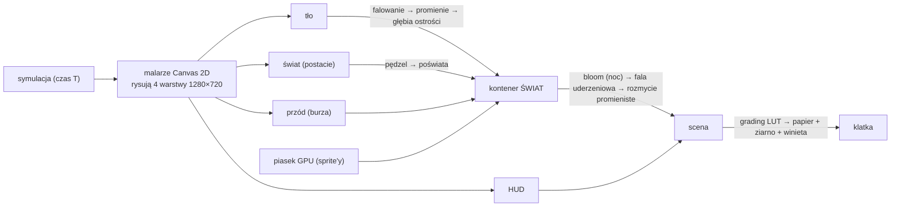
- **Filtr = shader na obrazku**: warstwa (tekstura) przechodzi przez mały program na GPU, który liczy nowy kolor każdego piksela. Filtry łańcuchowo: wynik jednego jest wejściem następnego.
- **Gdzie przypinasz filtr, tam działa**: na tle (falowanie tylko nad wydmami), na postaciach (pędzel tylko na nich), na całym świecie (fala uderzeniowa), na całej klatce (grading, papier). HUD omija większość, żeby napisy były ostre.
- **Determinizm**: każdy parametr jest funkcją czasu filmu `T` (a szum ma stałe ziarno), więc `seek(41.2)` daje zawsze ten sam obraz, jak w grze z powtórką (replay).
- **Koszt**: każdy filtr pełnoekranowy to dodatkowe przejście po ~0,9 mln pikseli. Na GPU (M3 Pro) cała klatka to ok. 40 ms *razem z zapisem PNG*; na żywo w przeglądarce ułamek tego.
- **Lekcja wydajności**: listę filtrów przypisuj raz; w klatce zmieniaj tylko parametry i `enabled`. Przypisywanie `filters = [...]` co klatkę przebudowuje stan GPU (u nas: 45 s → 0,8 s na klatkę).

---

## 1. Falowanie gorącego powietrza (heat haze) · nowe w v2
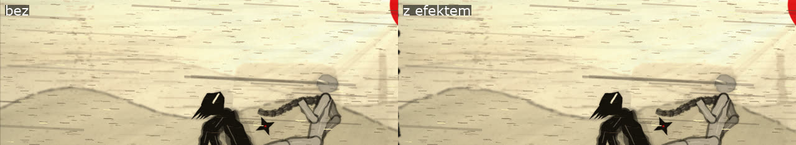
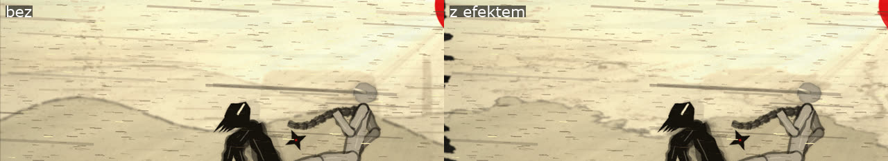
*Górny obrazek: siła normalna (na stopklatce prawie niewidoczna, w ruchu drga). Dolny: siła przesadzona ×5 tylko dla ilustracji.*
- **Co to:** gorące powietrze ugina światło, więc obraz za nim drga. W grach: pustynie, ogień, silniki, eksplozje; w filmie: upał, miraż.
- **Jak działa:** **displacement** (zniekształcenie): zamiast koloru piksela `(x, y)` shader bierze kolor z `(x + dx, y + dy)`, gdzie przesunięcie pochodzi z **szumu** (gładkiej losowej funkcji). Szum przesuwa się w czasie w górę, więc fale „płyną” jak unoszące się powietrze.
- **U nas:** własny fragment shader `HAZE_FRAG` na warstwie tła: szum fbm (kilka nałożonych warstw szumu), przesunięcie głównie w bok (±2–6 px), drobne fale pionowe; **maska**: tylko poniżej horyzontu (niebo stoi), mocniej w podmuchach (`windGust`) i **lokalnie wokół wirów** (ich pozycje na ekranie trafiają do shadera jako uniform `uDevils`).
- **Sprawdzenie (bez oglądania):** różnica pikseli z efektem i bez: wydmy 4,6% pikseli zmienionych, niebo 0,1%.
- **Pułapki:** za słabe = niewidoczne (pierwsza wersja ±0,5 px), za mocne = „pijany” obraz; długie fale (> 80 px) wyglądają jak falowanie wody, a nie powietrza.

## 2. Promienie światła przez pył (god rays) · nowe w v2
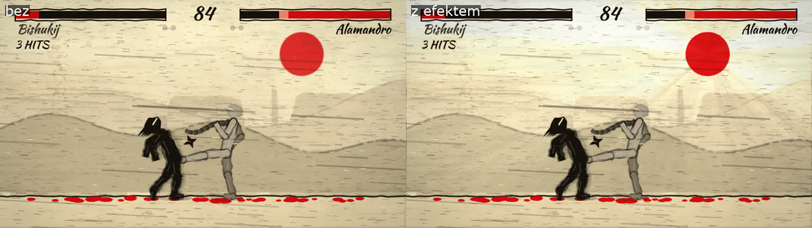
- **Co to:** smugi światła widoczne w pyle, mgle, dymie (światło rozprasza się na cząstkach). W grach: lasy, katedry, burze piaskowe; w filmie: klimat i „boskie” światło.
- **Jak działa:** dla każdego piksela shader sumuje jasność wzdłuż linii do źródła światła, modulowaną szumem: jaśniej tam, gdzie „przebija się” światło, ciemniej, gdzie pył je zasłania.
- **U nas:** `GodrayFilter` (pixi-filters) na warstwie tła, środek w tarczy słońca/księżyca (przeliczany z kamery), **siła rośnie z wiatrem** (więcej piasku w powietrzu = bardziej widoczne promienie), nocą mocniej przy piorunie.
- **Pułapka (złapana):** filtr pokrywał paskami samą tarczę słońca („wiatraczek”). Rozwiązanie: tarcza dorysowana jeszcze raz nad promieniami (warstwa przód).

## 3. Grading kolorów (LUT) · nowe w v2
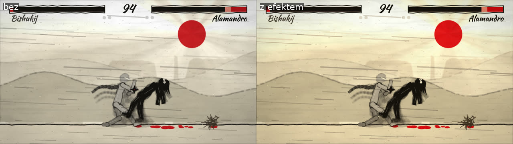
- **Co to:** nadanie całemu filmowi spójnego „looku” barwnego (jak w kinie: ciepłe westerny, zimne thrillery). W grach: osobny grading dla pory dnia, strefy, nastroju.
- **Jak działa:** **LUT** (lookup table) to tabela „kolor wejściowy → kolor wyjściowy” zapisana jako obrazek (u nas 16×16×16 kolorów w pasku 256×16). Shader dla każdego piksela odczytuje odpowiadający kolor z tabeli. Jedna tekstura = cały grading, koszt stały.
- **U nas:** `ColorMapFilter` na całej klatce; tablice **generowane kodem**: dzień = lekka krzywa S (kontrast), +18% nasycenia, cieplejsze światła (papier przestał szarzeć); noc = fioletowe cienie, ciepłe światła księżyca. Przełączane przy zmianie dzień/noc.
- **W praktyce:** koloryści robią LUT w programie do koloru (DaVinci Resolve) i eksportują jako `.cube`/obrazek; gra tylko go nakłada.

## 4. Fala uderzeniowa + rozmycie promieniste · nowe w v2
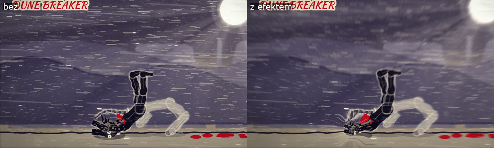
- **Co to:** „uderzenie” w obrazie przy mocnym ciosie: pierścień zniekształcenia rozchodzi się od miejsca trafienia, a kadr na moment szarpie rozmycie w stronę środka. W bijatykach i grach akcji: ciosy specjalne, eksplozje, lądowania (często razem z hitstopem i trzęsieniem kamery).
- **Jak działa:** **shockwave** = displacement w pierścieniu, którego promień rośnie z czasem; **zoom blur** = uśrednianie pikseli wzdłuż linii do środka.
- **U nas:** `ShockwaveFilter` + `ZoomBlurFilter` na kontenerze świata, **odpalane przez zdarzenia z logu symulacji** (chwyt SAND COBRA, BLACK MONSOON, K.O., lądowanie DUNE BREAKER, fatality); środek = miejsce trafienia na ekranie (staw ofiary). Fala trwa 0,9 s, rozmycie tylko 0,22 s, z ostrym środkiem 170 px.
- **Pułapka (złapana):** pierwsza wersja rozmywała cały kadr przez 0,35 s (postacie nieczytelne). Szarpnięcie ma być krótkie.

## 5. Piasek na GPU z błyskami · nowe w v2
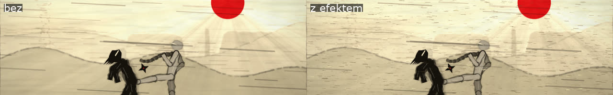
- **Co to:** tysiące drobnych cząstek. W grach: pył, deszcz, iskry, śnieg (systemy cząsteczek).
- **Jak działa:** każde ziarno to malutki **sprite** (prostokąt z teksturą) rysowany przez GPU; pozycje liczymy z czasu (bez symulacji fizycznej), więc 4000 ziaren to drobiazg.
- **U nas:** 2 plany (dalszy rozmyty, bliższy ostrzejszy), **napędzane tym samym polem wiatru co v7.5** (`windPhase`, `windGust`), więc obraz zgadza się z dźwiękiem wichury; w podmuchach więcej i dłuższych smug; losowe **błyski** pojedynczych ziaren (więcej przy piorunie).
- **Uczciwie:** za dnia efekt jest subtelny (jasne ziarna giną na jasnym papierze); lepiej widać go nocą i w ruchu.

---

## Efekty ze spike'a v1 (teraz na cały film)
| Efekt | Obrazek | Jak działa | U nas |
|---|---|---|---|
| **Papier, ziarno, winieta** | 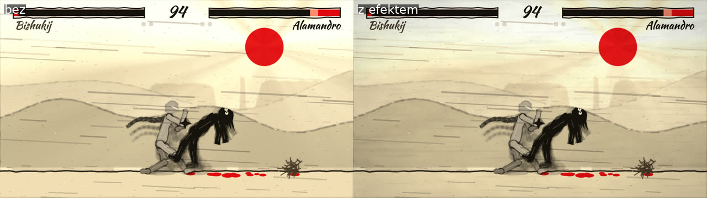 | shader: szum (włókna, plamy) mnoży kolor; ziarno = losowy szum zmieniany co klatkę; winieta = przyciemnienie od środka | własny `PAPER_FRAG` na całej klatce |
| **Mokry pędzel** | 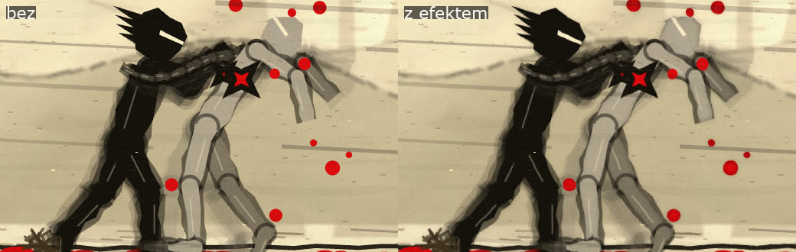 | krawędź przesunięta szumem (postrzępienie), ciemniejsza krawędź, delikatne halo „rozlania” wokół kształtu (z rozmytej alfy) | własny `BRUSH_FRAG` na warstwie postaci |
| **Głębia ostrości (DOF)** | 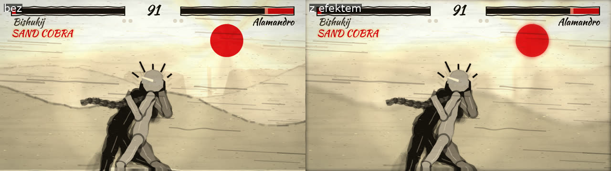 | rozmycie (Gauss) warstwy tła, siła rośnie ze zbliżeniem kamery | `BlurFilter` na tle |
| **Smugi ruchu** | 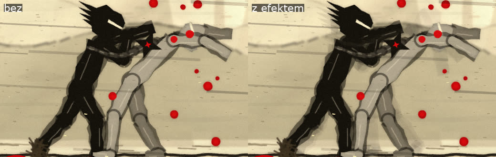 | „duchy”: wcześniejsze pozy szybkich kończyn rysowane półprzezroczyście (z historii symulacji, więc deterministyczne) | Canvas 2D, nie filtr |
| **Bloom nocą** | 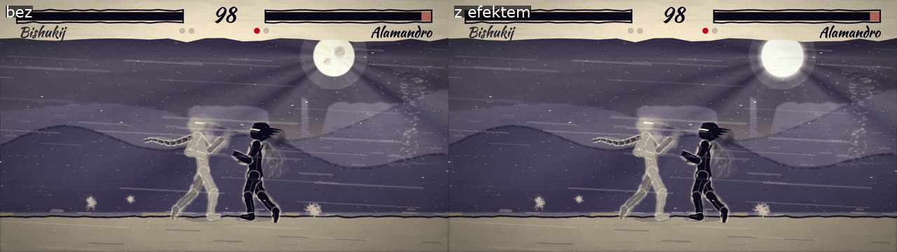 | wytnij jasne piksele (próg), rozmyj, dodaj do obrazu | `AdvancedBloomFilter` na świecie (HUD ostry) |
| **Światło pioruna** | 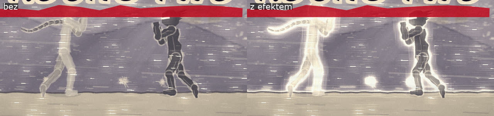 | poświata wokół kształtu (glow), siła = błysk pioruna | `GlowFilter` na postaciach |

## Ćwiczenia (jeśli chcesz pobawić się sam)
1. W konsoli przeglądarki na artefakcie (DevTools → wybierz ramkę artefaktu): `anim.setFx({ lut: false })`, potem `true`: zobacz, ile robi grading.
2. `anim.setFx({ hazeGain: 5 })` i odpal film: falowanie przesadzone.
3. Wyłącz wszystko oprócz papieru: `anim.setFx({ brush: false, dof: false, ghosts: false, bloom: false, rim: false, haze: false, godrays: false, lut: false, shock: false, sand: false })`: to prawie Canvas 2D z v7.5.
